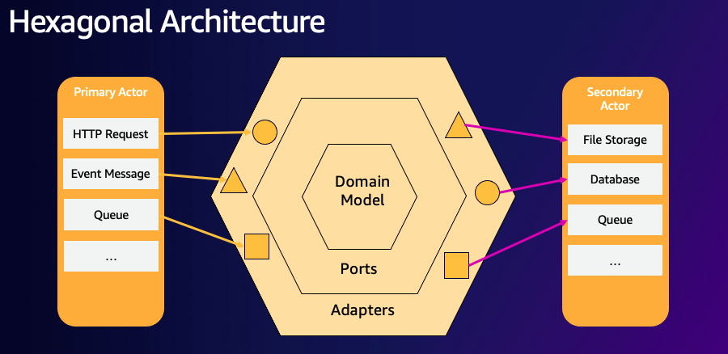
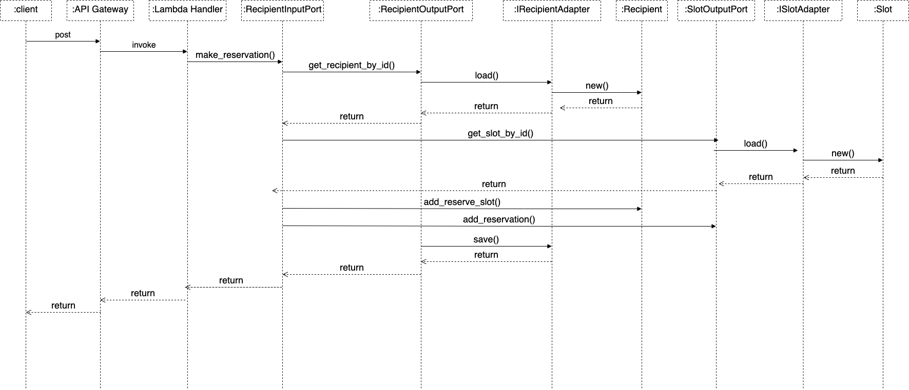

# Domain Model objects on AWS Lambda with Hexagonal Architecture Sample

[-[Readme in Japanese](README.ja.md)-]

## What is this project?

This project contains a Lambda function with domain model objects. By using Hexagonal Architecture (Ports and Adapters pattern), it separates domain model from other layer code.

The [Hexagonal Architecture](<https://en.wikipedia.org/wiki/Hexagonal_architecture_(software)>), or ports and adapters architecture, is an architectural pattern used in software design. The hexagonal architecture was invented by [Dr. Alistair Cockburn](https://en.wikipedia.org/wiki/Alistair_Cockburn).



The repository shows you how to implement your classes on the function. It includes sample domain models regarding a simple vaccination reservation system. With ports and adapters classes, domain model objects are loosely coupled from infrastructure code such as accessing to DynamoDB table.

This application also uses [inversion of control](https://en.wikipedia.org/wiki/Inversion_of_control) concept to inject ports and adapters classes. It enables you to execute unit testing more easily because you can inject dummy instances into target classes. For more details, see sample unit testing code in this project (./tests/unit folder).

## Class Diagram


## Sequence diagram



## Serverless Application Model

This project contains source code and supporting files for a serverless application that you can deploy with the SAM CLI. It includes the following files and folders.

- src - Code for the application's Lambda function.
- events - Invocation events that you can use to invoke the function.
- tests/unit - Unit tests for the application code.
- template.yaml - A template that defines the application's AWS resources.

## Deploy the sample application

The Serverless Application Model Command-Line Interface (SAM CLI) extends the AWS CLI that adds functionality to building and testing Lambda applications. It uses Docker to run your functions in an Amazon Linux environment that matches Lambda. It can also emulate your application's build environment and API.

To use the SAM CLI, you need the following tools.

- SAM CLI - [Install the SAM CLI](https://docs.aws.amazon.com/serverless-application-model/latest/developerguide/serverless-sam-cli-install.html)
- [Python 3 installed](https://www.python.org/downloads/)
- Docker - [Install Docker community edition](https://hub.docker.com/search/?type=edition&offering=community)

To build and deploy your application for the first time, run the following in your shell:

```bash
sam build --use-container
sam deploy --guided
```

The first command will build the source of your application. The second command will package and deploy your application to AWS, with a series of prompts:

You can find your API Gateway Endpoint URL in the output values displayed after deployment.

## Prepare DynamoDB data before you execute this function

When you execute this function you need to execute data prepare script.

```bash
$ chmod +x setup/add_ddb_data.sh
$ setup/add_ddb_data.sh

```

## Use the SAM CLI to build and test locally

Build your application with the `sam build --use-container` command.

```bash
$ sam build --use-container
```

The SAM CLI installs dependencies defined in `src/requirements.txt`, creates a deployment package, and saves it in the `.aws-sam/build` folder.

Test a single function by invoking it directly with a test event. An event is a JSON document that represents the input that the function receives from the event source. Test events are included in the `events` folder in this project.

Run functions locally and invoke them with the `sam local invoke` command.

```bash
$ sam local invoke ReservationFunction --event events/event.json
```

## Tests

Tests are defined in the `tests` folder in this project. Use PIP to install the test dependencies and run tests.

```bash
$ pip install -r tests/requirements.txt --user
# unit test
$ python -m pytest tests/unit -v
```

## Cleanup

To delete the sample application that you created, use the SAM CLI. Assuming you used your project name for the stack name, you can run the following:

```bash
sam delete --stack-name [Stack Name]
```

## Resources

See the [AWS SAM developer guide](https://docs.aws.amazon.com/serverless-application-model/latest/developerguide/what-is-sam.html) for an introduction to SAM specification, the SAM CLI, and serverless application concepts.
